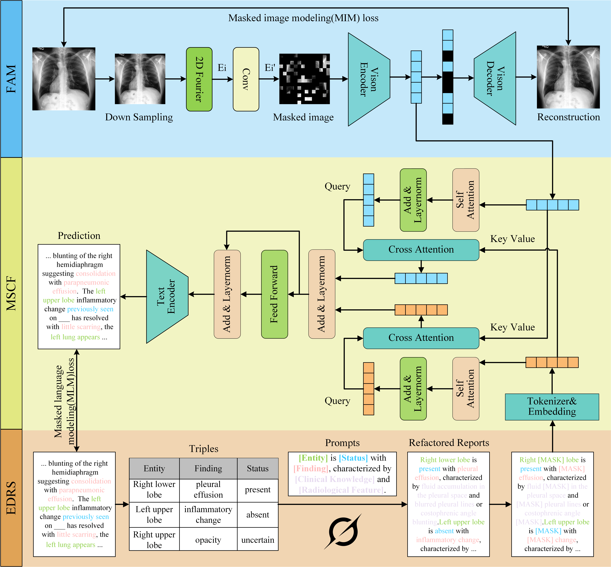

# Medical Vision-Language Pre-training Framework
This repository provides the code for the official implementation of "EFMP: Entity-driven Frequency-aware Medical Vision Language Pretraining".  



Some code is borrowed from [MAE](https://github.com/facebookresearch/mae), and [MRM](https://github.com/RL4M/MRM-pytorch)

## Installation
Clone this repository:
```
git clone 
```
Install Python dependencies:
```
conda env create -f environment.yml
```

## Resource fetching
We offer the pre-training and fine-tuning code of EFMP, whose contribution is **pre-training representative and multi-scale features from complex and imbalanced medical reports**. We pre-train our method both on MIMIC-CXR dataset.

- **MIMIC-CXR**: We download the [MIMIC-CXR-JPG](https://physionet.org/content/mimic-cxr-jpg/2.0.0/) dataset as the radiographs. Paired medical reports can be downloaded in [MIMIC-CXR](https://physionet.org/content/mimic-cxr/2.0.0/mimic-cxr-reports.zip).

You can download ViTB/16 checkpoint [here]() for pretraining.  
Our pre-trained model can be found [here]().

## Pre-training
We pre-train the model on MIMIC-CXR using this command:
```
cd EFMP/EFMP/Pre-training
chmod a+x run.sh
./run.sh
```
Note that it is flexible to develop other pre-training models under this framework.  


## Fine-tuning
We perform fine-tuning classification, fine-tuning segmentation and detection for downstream tasks.

### Datasets

- **ChestX-ray14**: We download the [ChestX-ray14](https://nihcc.app.box.com/v/ChestXray-NIHCC) dataset using its official split for classification.
- **CheXpert**: We use the [CheXpert](https://stanfordmlgroup.github.io/competitions/chexpert/) consisting of 224,316 chest radiographs of 65,240 patients.
- **RSNA**: We use the stage 2 of [RSNA Pneumonia](https://www.rsna.org/rsnai/ai-image-challenge/rsna-pneumonia-detectionchallenge-2018) dataset.
- **COVIDx**: We use the version 7 of [COVIDx CXR](https://www.kaggle.com/datasets/andyczhao/covidx-cxr2/versions/7) dataset.
- **SIIM-ACR Pneumothorax**: We use the stage 1 of [SIIM-ACR Pneumothorax](https://www.kaggle.com/c/siim-acr-pneumothorax-segmentation).


### Classification
We evaluate fine-tuning classification performance of our model using this command:
```
CUDA_VISIBLE_DEVICES=0 python train.py --name efmp --stage train --model vit_base_patch16 --task ChestX-ray14 --num_classes 14 \
    --pretrained_path '$PATH_TO_PRETRAINED_MODEL.pth' --dataset_path '$PATH_TO_ChestX-ray14/' \
    --output_dir "output/ChestX-ray14/1/" --data_volume '1' --num_steps 3000  --eval_batch_size 512 --img_size 224 \
    --learning_rate 3e-2 --warmup_steps 50 --fp16 --fp16_opt_level O2 --train_batch_size 96
```
You can change ```--task``` to set specific dataset for fine-tuning classification. Here, 4 datasets are available: ChestX-ray14, CheXpert, RSNA, and COVIDx. The ```--data_volume``` parameter can be set to identify the fraction of training data for fine-tuning.

### Segmentation
We evaluate fine-tuning segmentation performance of our model using this command:
```
CUDA_VISIBLE_DEVICES=0 python train.py --name efmp --stage train --model vit_base_patch16 --task RSNA --img_size 224 \
    --pretrained_path '$PATH_TO_PRETRAINED_MODEL.pth' --dataset_path '$PATH_TO_RSNA/' \
    --output_dir "output/RSNA/1/" --data_volume '1' --num_steps 3000  --eval_batch_size 512 \
    --learning_rate 3e-4 --warmup_steps 50 --fp16 --fp16_opt_level O2 --train_batch_size 96 --weight_decay 0.05
```
You can change ```--task``` to set specific dataset for segmentation, where 2 datasets are available: SIIM-ACR Pneumothorax and RSNA. The ```--data_volume``` parameter can be set to identify the fraction of training data for fine-tuning.


### Detection
We evaluate fine-tuning detection performance of our model using this command:
```
CUDA_VISIBLE_DEVICES=0 python train.py --name efmp --stage train --model vit_base_patch16 --task RSNA --img_size 224 \
    --pretrained_path '$PATH_TO_PRETRAINED_MODEL.pth' --dataset_path '$PATH_TO_RSNA/' \
    --output_dir "output/RSNA/1/" --data_volume '1' --num_steps 3000  --eval_batch_size 512 \
    --learning_rate 3e-4 --warmup_steps 50 --fp16 --fp16_opt_level O2 --train_batch_size 96 --weight_decay 0.05
```

Hope you enjoy!
